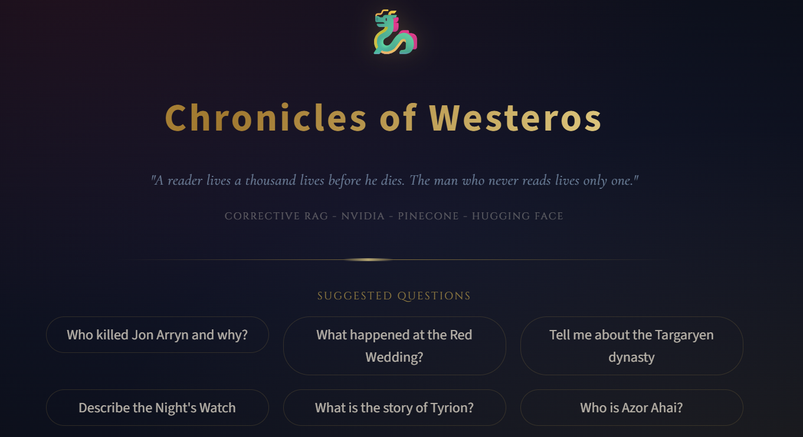
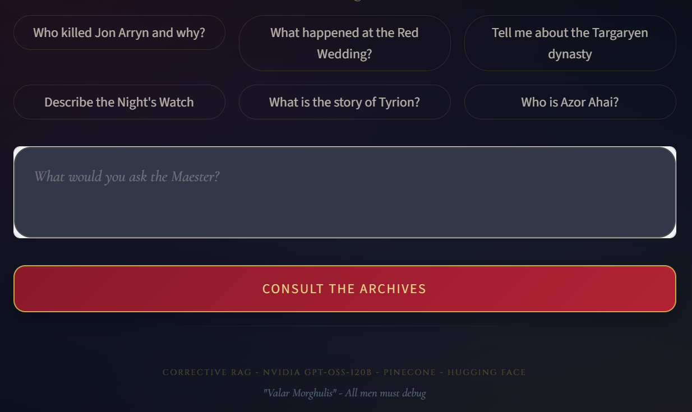

# 🐉 Corrective RAG — Game of Thrones QA

**A self-correcting RAG agent that knows when it doesn't know the answer.**

Most RAG systems retrieve a few chunks, stuff them into a prompt, and hope for the best. This one is different: it **grades its own answers** before showing them to you, and automatically falls back to live web search when the local knowledge base falls short — built and tested on the *A Song of Ice and Fire* book.

🔗 **[Live Demo](https://correctiveraggit-jprmgukhebrkb3y6zgnorz.streamlit.app)**


---

## Why This Project

Standard RAG pipelines are "retrieve and hope." If the vector store doesn't have relevant chunks, the model still confidently answers often wrong. This project implements a **corrective loop**: the LLM evaluates its own generated answer against the retrieved context, and only accepts it if it's actually sufficient. If not, it escalates to a live web search and reanswers, rather than silently hallucinating.

This mirrors patterns used in production agentic systems: retrieval → self-critique → conditional tool use → re-generation.

## How It Works

```
User Question
     │
     ▼
Query Planning (LLM structures/decomposes the query)
     │
     ▼
Pinecone Vector Search  ──►  Retrieve top-k book chunks
     │
     ▼
Generate Answer from Retrieved Context
     │
     ▼
LLM Self-Evaluation: "Is this answer sufficient?"
     │
     ├── Yes ──► Return Answer
     │
     └── No  ──► Web Search Fallback ──► Re-generate Answer ──► Return Answer
```

## Key Features

- **Corrective feedback loop** — the LLM acts as its own judge, deciding whether retrieved context is sufficient before answering
- **Agentic query planning** — decomposes and structures user queries before retrieval (optional, toggleable via `SKIP_QUERY_PLAN`)
- **Hybrid retrieval** — falls back to realtime web search only when local vector search is insufficient, controlled by tunable thresholds (`WEB_SCORE_THRESHOLD`, `WEB_MIN_CHUNKS`, `WEB_MIN_TERM_MATCH`)
- **Configurable & production-minded** — rate limiting, retry logic, and request delays for the NVIDIA API; batch upsert and checkpointing for embedding large books
- **Decoupled architecture** — FastAPI backend + Streamlit frontend, communicating over a configurable API URL, so either can be swapped or deployed independently

## Tech Stack

| Layer | Technology |
|---|---|
| LLM (planning + answering) | NVIDIA `gpt-oss-120b` |
| Embeddings | Hugging Face Inference API |
| Vector Store | Pinecone |
| Backend | FastAPI |
| Frontend | Streamlit |
| Web Search Fallback | Ollama-based search API |

## Screenshots




## Repo Structure

```
backend/
  main.py        # FastAPI API server
  agent.py       # retrieval + corrective RAG logic
  embed.py       # document ingestion + Pinecone upsert
frontend/
  frontend.py    # Streamlit UI
requirements.txt
```

## Setup

1. Create and activate a virtual environment
2. Install dependencies:
   ```
   pip install -r requirements.txt
   ```

## Environment Variables

**Required for core functionality:**
- `NVIDIA_API_KEY`
- `PINECONE_API_KEY`
- `HF_TOKEN` **or** `HUGGINGFACE_API_KEY`

**Optional / recommended:**
- `CRAG_API_URL` (frontend → backend URL; default `http://127.0.0.1:8000/query`)
- `WEB_SEARCH_ENABLED` (`true` / `false`)
- `OLLAMA_API_KEY` (required if web search enabled)

**Tuning / advanced:**
- `RETRIEVAL_TOP_K`
- `WEB_SCORE_THRESHOLD`
- `WEB_MIN_CHUNKS`
- `WEB_MIN_TERM_MATCH`
- `SKIP_QUERY_PLAN` (`true` to skip query planning)
- `LOG_LEVEL`, `CRAG_LOG_LEVEL`
- `CRAG_TIMEOUT_SECONDS`
- `HUGGINGFACE_EMBED_MODEL`
- `NVIDIA_JSON_MODEL`
- `NVIDIA_API_URL`
- `NVIDIA_REQUEST_DELAY_SECONDS`
- `NVIDIA_MAX_RETRIES`
- `NVIDIA_RPM_LIMIT`
- `EMBED_DELAY_SECONDS`
- `UPSERT_BATCH_SIZE`
- `EMBED_CHECKPOINT_FILE`
- `PINECONE_METRIC`, `PINECONE_CLOUD`, `PINECONE_REGION`
- `SINGLE_BOOK_TITLE`, `SINGLE_BOOK_NUMBER`, `SINGLE_BOOK_SLUG`

## Ingest / Embed Books

From the repo root:
```
python backend/embed.py --source Book_Name.pdf --index-name crag
```

## Run Backend (FastAPI)

From repo root:
```
uvicorn backend.main:app --reload
```
Or from `backend/`:
```
uvicorn main:app --reload
```

Health check:
```
GET http://127.0.0.1:8000/health
```

## Run Frontend (Streamlit)

```
streamlit run frontend/frontend.py
```
Set `CRAG_API_URL` if the backend is not running locally.

## Limitations & Future Work

- Currently scoped to the ASOIAF book; not yet generalized to arbitrary document sets via the UI
- Self-evaluation quality depends on the judging LLM's prompt calibration a formal eval set (precision/recall on known Q&A pairs) would make this rigorous rather than anecdotal
- Web fallback currently re-answers from scratch rather than merging local + web context
- Next steps: caching layer for repeated queries, structured citation of source chunks in answers, and a lightweight eval harness to track answer quality over time

## License

MIT — feel free to fork and adapt.

## Author

Built by **Pal Trivedi**. Feedback and PRs welcome.
